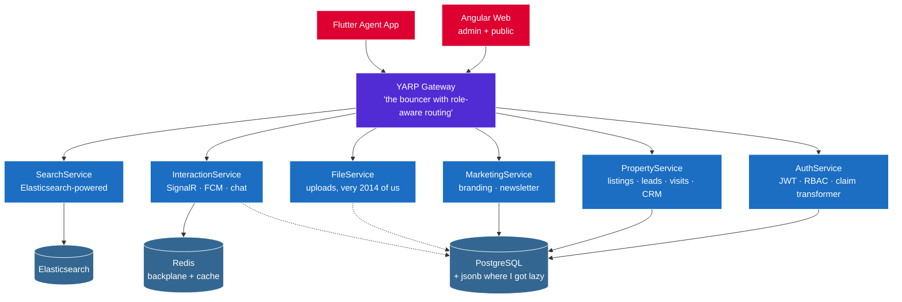

<div align="center">


<a href="https://github.com/iMu21">
  
</a>

<p>
  
  
  
  
</p>

</div>

---

### About

I build enterprise **.NET / Angular** systems for international clients by day, and a multi-service distributed real-estate platform on my own time. Three years at **Brain Station 23**, four delivered products across **insurance, law enforcement, and logistics**.

---

### Professional Work · Brain Station 23 · since July 2022

> Three years of ASP.NET Core in production for clients in three countries. Insurance, law enforcement, logistics — pick your favourite synonym for "unsexy but mission-critical."


<table>
<tr>
<td valign="top" width="60%">

**Stella International (USA)** · Oct 2025 – present

Cases, evidence, and chain-of-custody — modeled the way they need to be when *"it works on my machine"* doesn't fly in court.

<p>


</p>

</td>
<td valign="top" width="40%" align="center">
  
</td>
</tr>
</table>


<table>
<tr>
<td valign="top" width="60%">

**Stella International (USA)** · Jun 2025 – present

Yes, the world needed *one more* invoicing system for logistics. This one has pagination, search, and an audit trail — the trifecta of "boring features that ship."

<p>


</p>

</td>
<td valign="top" width="40%" align="center">
  
</td>
</tr>
</table>


<table>
<tr>
<td valign="top" width="60%">

**Guardian Life Insurance (BD)** · Sep 2024 – May 2025

Policies and claims for people who'd really rather not be filing one. UX matters more here than the architecture diagram — every extra click is a small failure.

<p>


</p>

</td>
<td valign="top" width="40%" align="center">
  
</td>
</tr>
</table>


<table>
<tr>
<td valign="top" width="60%">

**MetLife (BD)** · Nov 2022 – Aug 2024

The full insurance-claim lifecycle as a C# state machine — turns out *"awaiting review"* is a non-trivial engineering problem once you scale it past a spreadsheet.

<p>


</p>

</td>
<td valign="top" width="40%" align="center">
  
</td>
</tr>
</table>

---

### After-hours Architecture · Multi-tenant Real-Estate Platform

> A side project that escaped containment. Started as "a website to find apartments" and is now six microservices behind a YARP gateway, a Flutter app, SignalR over Redis, FCM with deep links, and Elasticsearch. Could it have been a monolith? Yes. Is it? No.



- **Six .NET services** behind a YARP gateway with role-aware routing and per-cluster health checks. Five too many for the use case, exactly the right number for the learning curve.
- **Multi-tenant + branch-scoped RBAC** with a custom JWT claim transformer, because every service had its own opinion about whether the role is `BranchAgent`, `branch_agent`, or `agent`. Now they all agree.
- **Real-time stack** — SignalR chat over a Redis backplane, plus a per-device FCM token registry that actually deactivates dead tokens instead of pretending. Notifications carry `entityType`/`entityId`/`deepLink` so taps land on the right screen.
- **Live agent ops** — GPS-verified visit logs (because "I was there, trust me" doesn't pass code review), offline-buffered location batch sync, and a 7-stage CRM lead pipeline that refuses to let you skip stages just because the deal's hot.
- **Three frontends, one gateway** — Angular admin & public web, Flutter agent mobile. They all complain to the same auth service in the same way, which is the whole point.

---

### Status Report

```text
═══════════════════════════════ status ═══════════════════════════════
  Years at Brain Station 23 ......... 3  (and counting)
  Production projects shipped ....... 4  (insurance × 2 · LE · logistics)
  Countries billed in ............... 3  (BD · USA · the cloud)
  Microservices in side-project ..... 6  (five too many — on purpose)
  Languages on the daily ............ 3  (C# · TypeScript · Dart)
  Codeforces / LeetCode problems .. 1500+ (some of them on the first try)
  Programming-contest titles ........ 1  (PSTU Intra-Univ. Champion · S2)
  Birds in the household ............ 3  (loud · opinionated · unbothered)

  Currently shipping ................ Stella · Law Enforcement Cases
  Currently shipping ................ Stella · Logistics Invoicing
  Currently architecting (for fun) .. Real-estate platform v∞
  Currently grinding ................ another Codeforces round
  Currently caffeinated ............. yes
═══════════════════════════════════════════════════════════════════════
```

---

### Tech Stack

<div align="center">

**Backend**


**Frontend & Mobile**


**Data**


**Infra & Tooling**


</div>

---

### Public Repos · Fundamentals

- **[CQRSOrderManagement](https://github.com/iMu21/CQRSOrderManagement)** — order pipeline with a hand-rolled CQRS dispatcher, no MediatR.
- **[AuthShield](https://github.com/iMu21/AuthShield)** — clean-architecture .NET 8 starter for JWT auth & identity, MediatR-based.
- **[ApiChangeTracker](https://github.com/iMu21/ApiChangeTracker)** — hashes a Swagger doc on a schedule, snapshots only when the API surface changes.
- **[Competitive-Programming](https://github.com/iMu21/Competitive-Programming)** — 1,500+ problems across LeetCode and Codeforces.
- **[CLiCSForecast](https://github.com/iMu21/CLiCSForecast)** — applying data analysis & ML over CLiCS data (Jupyter).
- **[ExpenseTracker](https://github.com/iMu21/ExpenseTracker)** — personal-finance app on ASP.NET Core MVC + EF Core + Identity.

---

### Highlights

> **Champion** — PSTU Intra University Programming Contest, Season 2.
>
> **1,500+** algorithmic problems solved across LeetCode and Codeforces.
>
> **Three-domain experience inside a single role** — insurance · law enforcement · logistics, on the same .NET stack.

---

### Off the Keyboard

When the IDE is closed: I'm probably **playing video games**, **looking after my birds**, or grinding another Codeforces round. I think hobbies are part of the engineer — pattern-spotting in a competitive programming problem and pattern-spotting in your aviary are not as different as they look.

---

### Education

**B.Sc. in Computer Science & Engineering** — Patuakhali Science & Technology University · 2017 – 2022.

---

<div align="center">

### Connect

<a href="https://github.com/iMu21"></a>
<a href="https://www.linkedin.com/in/md-imran-khan-b9450b194/"></a>
<a href="mailto:mdimrankhan.imu21@gmail.com"></a>

<br/>


</div>
