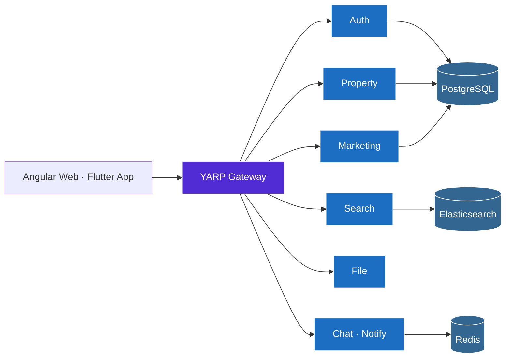

 

**i build** distributed systems &nbsp;·&nbsp; **and overthink** monoliths &nbsp;·&nbsp; **and feed** three loud birds

 

## Work

Three years at **Brain Station 23**, four shipped products for clients in BD and the USA.

| Project | Client | Year |
|---|---|---|
| Law Enforcement Case Management | Stella International (USA) | 2025 – present |
| Invoice Management System | Stella International (USA) | 2025 – present |
| Guardian Life App | Guardian Life Insurance (BD) | 2024 – 2025 |
| Claims Integrated Care System | MetLife (BD) | 2022 – 2024 |

`ASP.NET Core` · `EF Core` · `Angular` · `SQL Server` · `XUnit` · `GitHub Actions`

 

## After-hours

A self-directed multi-tenant real-estate platform — six .NET microservices behind a YARP gateway, an Angular admin/web app, and a Flutter agent mobile app. Could it have been a monolith? Yes. Is it? No.

`SignalR over Redis` · `FCM with deep links` · `Hangfire` · `Elasticsearch` · `Docker`

 

&nbsp;

&nbsp;

  

<i>~ written in Markdown · debugged in production · last patched whenever ~</i>

